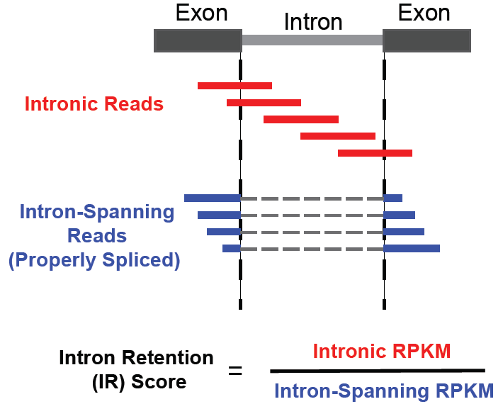

# Intron retention
**Intron retention** is a method for intron retention (IR) events in RNA sequencing data.

See our [manuscript](https://www.biorxiv.org/content/10.1101/864165v1) for more details.

 

**Workflow** For each intron feature, the following two read classes are defined: (1) “intronic” reads mapping at least 6 bases contiguously within the intron and (2) “spanning” reads with ends mapping to the flanking exons. The intron retention (IR) score is computed as the ratio of the RPKM-normalized “intronic” read density over the RPKM-normalized “spanning” read density. 

## Reproducibility
To reproduce the analysis and figures presented in our manuscript please see the [*Reproducibility*](https://github.com/lkmklsmn/DrivAER/tree/master/Reproducibility) folder.

## Check out our live, interactive tutorial!
The following [Google colab](https://colab.research.google.com/) notebooks allow you to interactively explore DrivAER and can be run within your browser. We have prepared two analysis examples:
1. [Blood development](https://colab.research.google.com/drive/1zrQ7l3Orz7h-eGEX7MHRIBTTXzL_vu9O#scrollTo=VzAzfdHZrOWz)
2. [Interferon stimulation](https://colab.research.google.com/drive/13DA_dYlRjlKma1d9VB65JrfPhBvkEGDC#scrollTo=roa2rIBT1s_R)

## Installation
### via pip
	pip install git+https://github.com/lkmklsmn/DrivAER.git
### via git
	git clone https://github.com/jareyw/intron
	cd intron
	python setup.py install

## Input
1. Raw count expression matrix
2. Outcome of interest (pseudotemporal ordering/cell grouping etc)
3. Gene set annotation

## Output
1. Relevance scores for each annotated transcriptional program
2. Data manifolds derived from each transcriptional program
3. Various visualizations (heatmap, DCA embedding, barplots)

## Usage
Describe how to run IR in a few lines of pseudocode

## License

